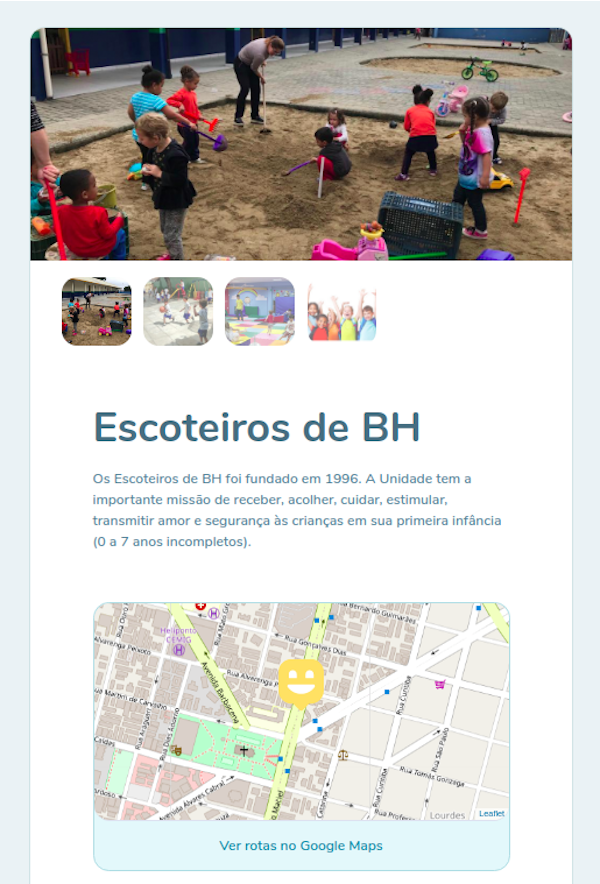
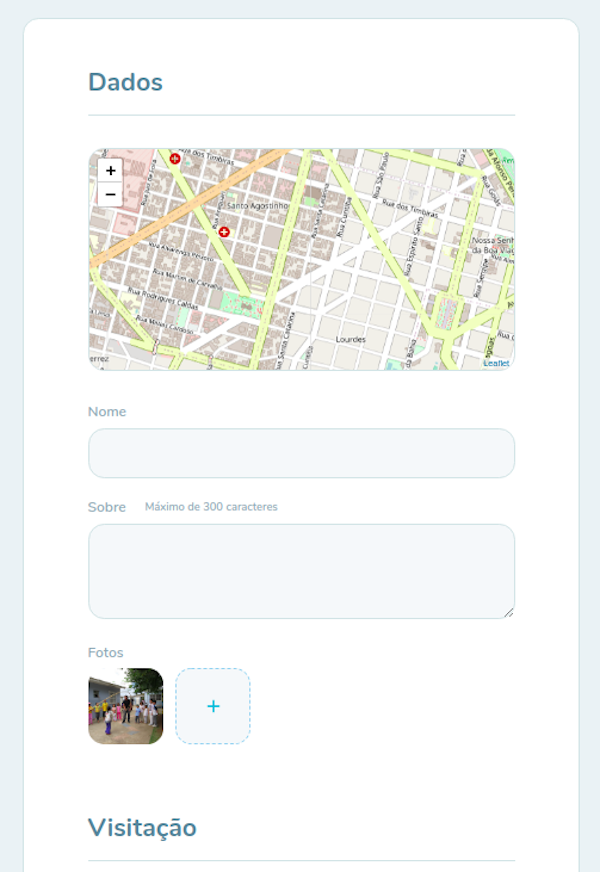

## SACRA - Website for a Therapeutic Educational Center

El sitio web de **SACRA** conecta a las personas con discapacidades con los Centros de Educacion Especial dentro de la ciudad de Salta, Argentina con el objectivo de mejorar las oportunidades y la dignidad de la persona con discapacidad.

### :computer: Technologies used
- React.js
- Next.js
- TypeScript
- Node.js
- Express
- Leaflet (For displaying maps)
- Yup (For input validations)
- Prisma
- PostgreSQL

:camera: **Preview images**

- :house: **Home page**

#

- :round_pushpin: **Map of Institutions**

#

- :movie_camera: **Tour**

#

- :movie_camera: **Tour Cadastro:**

Developed by Lautaro Figueroa [linkedin.com/in/lautaro-figueroa-it](https://www.linkedin.com/in/lautaro-figueroa-it/)
