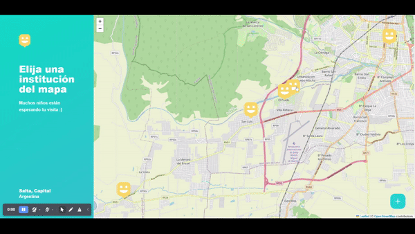
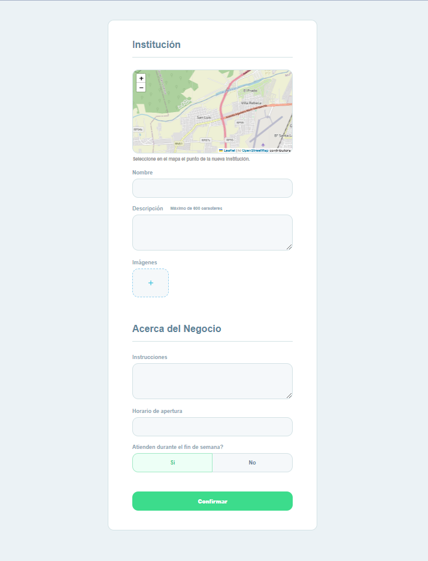
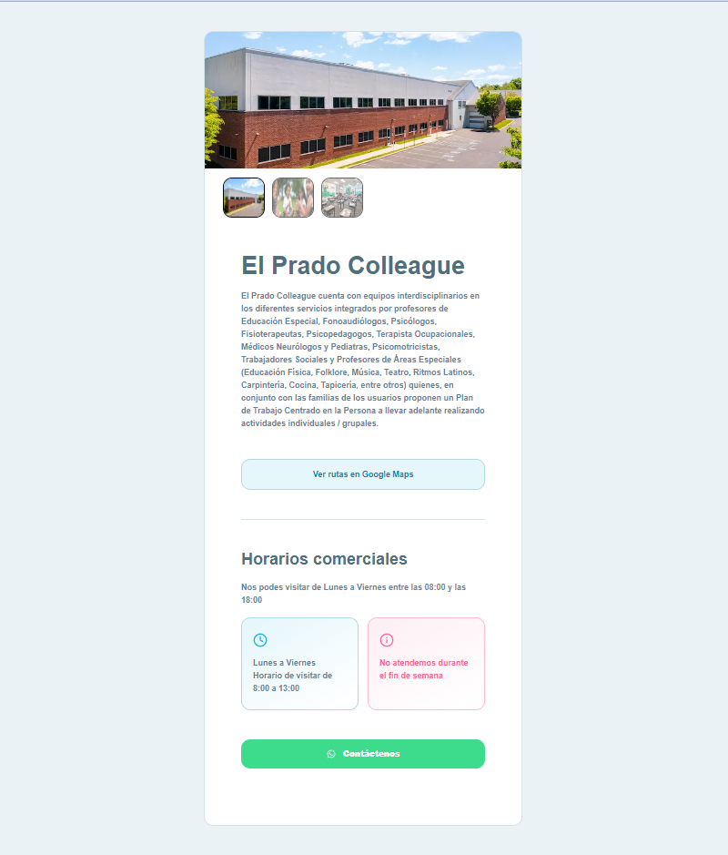

## SACRA - Website for a Therapeutic Educational Center

The **SACRA** website connects people with disabilities with Special Education Centers within the city of Salta, Argentina with the objective of improving the opportunities and dignity of the person with disabilities.
They promote the inclusion of people with disabilities in our society by providing the necessary support for full and effective participation, on equal terms with others. :heart:

### :computer: Technologies used
- React.js
- Next.js
- TypeScript
- Node.js
- Prisma
- PostgreSQL 

### Other:
- Cloudinary (For uploading and retrieving high-quality images)
- Leaflet (For displaying interactive maps)
- Yup (For input validations)

### :camera: **Preview**

- :movie_camera: **Tour 1**

#

- :movie_camera: **Tour 2**

#

- :round_pushpin: **Register institution**

#

- :round_pushpin: **Institution's page**

Developed by Lautaro Figueroa [linkedin.com/in/lautaro-figueroa-it](https://www.linkedin.com/in/lautaro-figueroa-it/)
